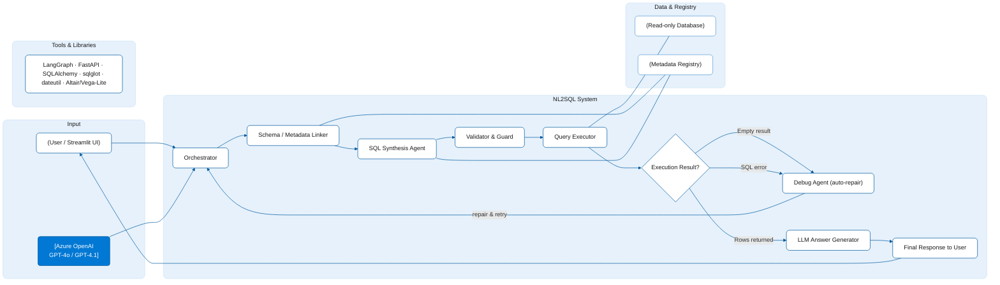

# 🧠 NL2SQL — Natural Language → SQL for Manufacturing Analytics


> A production‑ready NL2SQL system that converts **natural language** questions into **validated SQL**, executes them on an **AdventureWorks-style manufacturing database**, and returns:
> - Human-friendly answers  
> - Final SQL  
> - Tabular results  
> - Auto-generated charts  

---

## ✨ Key Highlights

- **Complete NL2SQL pipeline:**  
  *User Query → Intent → SQL Generation → Validation → Execution → Answer → Visualization*
- **Manufacturing-aware:** costs, suppliers, work orders, rejects, timestamps, currency/date analytics  
- **Safe SQL generation:** SELECT-only, schema validated, retry logic  
- **Insightful outputs:** human-like answers, SQL, data table, chart recommendations  

---


## 🧭 Architecture at a Glance




### 📌 Chart Selection Rules
- **Line chart** → Time series  
- **Bar chart** → Category-based aggregates  
- **Pie chart** → Composition breakdowns  

---

## 🏭 Manufacturing Scope

### Supported Analytics
- Raw material & production **costs**  
- Work order **scheduled vs actual** timestamps  
- Supplier **purchase order quantities**  
- Incoming **reject/scrap quantities**  
- Integer, currency, and date-based manufacturing metrics  

### Example Queries
- “Total raw material cost for January 2024”  
- “Work orders where actual end date exceeded scheduled date”  
- “Top 10 suppliers by purchase order quantity”  
- “Monthly trend of incoming rejects”  

---

## 🗂️ Repository Structure

```
NL2SQL/
│── frontend.py                # Streamlit chatbot UI
│── backend/
│   ├── api.py                 # FastAPI entrypoint
│   ├── pipeline.py            # NL2SQL pipeline
│   ├── intent.py              # Intent parsing
│   ├── schema.py              # Schema + join logic
│   ├── sqlgen.py              # SQL construction
│   ├── validate.py            # SELECT-only validation
│   ├── execute.py             # SQL execution engine
│   ├── answer.py              # Natural language answer generation
│   └── charts.py              # Chart configuration builder
│── config/
│   ├── schema.json            # Manufacturing schema
│   └── settings.yaml          # Configurations
│── data/                      # Optional dataset
│── requirements.txt
└── README.md
```

---

## ⚙️ Setup & Installation

### 1️⃣ Clone the repository
```bash
git clone https://github.com/mahithi906/NL2SQL.git
cd NL2SQL
```

### 2️⃣ Create & activate virtual environment
```bash
python -m venv .venv
# Windows
.venv\Scripts\activate
# macOS/Linux
source .venv/bin/activate
```

### 3️⃣ Install dependencies
```bash
pip install -r requirements.txt
```

---

## 🔌 Database Configuration

Create `.env` file:

```env
DB_DRIVER=postgresql
DB_HOST=localhost
DB_PORT=5432
DB_NAME=adventureworks
DB_USER=your_user
DB_PASSWORD=your_password
```

### Data Sources
- Kaggle: https://www.kaggle.com/datasets/universalanalyst/adventureworks-sample-mfg-database-tables  
- Microsoft Docs: https://learn.microsoft.com/en-us/sql/samples/adventureworks-install-configure

Ensure your DB matches `config/schema.json`.

---

## ▶️ How to Run

### 1️⃣ Start backend (FastAPI)
```bash
uvicorn backend.api:app --reload --port 8000
```

### 2️⃣ Start chatbot UI (Streamlit)
```bash
streamlit run frontend.py
```

Visit: http://localhost:8501/

---

## 💬 Example Prompts

- “Total raw material cost for January 2024”  
- “How many work orders finished after the scheduled end date?”  
- “Top 10 suppliers by purchase order quantity in 2023”  
- “Monthly trend of incoming rejects”  
- “Average production cost by product category”  

---

## 🧠 API (FastAPI)

### POST `/nl2sql/query`

#### Request
```json
{
  "question": "Show total raw material cost for January 2024",
  "options": { "limit": 100, "visualize": true }
}
```

#### Success Response
```json
{
  "answer": "The total raw material cost for January 2024 was ₹5,43,000.",
  "sql": "SELECT ...",
  "table": [{ "col1": "value" }],
  "chart": { "type": "bar", "data": {} },
  "meta": { "elapsed_ms": 128, "rows": 12 }
}
```

#### On Failure (after 3 attempts)
```json
{
  "error": "No valid result could be generated for your query.",
  "retries": 3
}
```

---

## ✅ SQL Safety & Validation

- SELECT-only (no INSERT/UPDATE/DELETE)  
- Validates tables & columns  
- Ensures join paths  
- Rejects unsafe patterns  
- Retry loop (≤3 times)  

---

## 📊 Visualization Engine

- **Line** → time-series  
- **Bar** → category-based  
- **Pie** → composition  
- Outputs JSON config for Streamlit rendering  

---

## 🧪 Testing

```bash
pytest -q
```

Quick test:
```bash
curl -X POST http://localhost:8000/nl2sql/query \
  -H "Content-Type: application/json" \
  -d "{\"question\":\"Top 10 suppliers by purchase order quantity\"}"
```
## 🙌 Credits
- Developed by: Mahithi Reddy
- Mentorship: Ashfak K A
- Inspired by AdventureWorks Manufacturing Schema
---

